# VSM Generator

Value Stream Mapping (バリューストリームマップ) をブラウザで生成する web アプリ。
工程を表に入力すると VSM 図 (SVG) と Lean の指標を自動生成し、
「省略」「待ち削減」で Future State をシミュレーションして Current State と比較できる。

## 起動

```sh
npm install
npm run dev      # http://localhost:5173
npm test         # vitest
npm run build    # dist/
```

## 使い方

1. 工程表で工程を追加し、工程名 / 担当 / 待ち / PT / LT / %C&A を入力する
2. 上部の VSM 図とサマリがリアルタイムに更新される
3. 待ち率や %C&A がしきい値を超えた工程には ⚡ (Kaizen Burst) が付く。しきい値はヘッダで変更できる
4. 「省略」にチェック、または「待ち削減 %」を動かすと Future State ができる。図の Current / Future タブで切替
5. JSON 保存 / 読込、SVG 出力ができる。データはブラウザ (localStorage) に自動保存される

## そもそも VSM とは (初めての方へ)

「頼んでから届くまで」の仕事の流れを 1 本の線にして、**どこで時間が消えているか**を見つける手法です。

役所の手続きを思い浮かべてください。書類を書くのは 10 分なのに、窓口の順番待ちや別の課への回送で半日かかる。
この「書く 10 分」が PT (実作業時間)、「半日」が Lead Time (経過時間)、差が「待ち」です。
仕事の流れも同じで、多くの場合、時間の 8〜9 割は誰も手を動かしていない「待ち」です。
VSM はそれを数字と図で見せて、「作業を速くする」より「待ちをなくす」方が効く場所を教えてくれます。

アプリ内の「用語解説」ボタンを押すと、各用語の意味と具体例が表示されます。

## 用語 (やさしい版)

例はすべてサンプルの「設計」工程 (待ち 3日 / PT 3日 / LT 10日 / %C&A 70%) を使っています。

```mermaid
gantt
  title 「設計」工程の時間の内訳 (合計 13日)
  dateFormat X
  axisFormat %s日
  section 待ち
  前工程が終わってから着手するまで (待ち 3日)   :w, 0, 3
  section 工程 (LT 10日)
  手を動かしている (PT 3日)                    :active, p, 3, 6
  着手したが放置されている (工程内の待ち 7日)     :i, 6, 13
```



| 用語 | ひとことで | 例 |
|---|---|---|
| 工程 | 仕事のひとつの段階 | 「設計」 |
| 待ち | 前の工程が終わってからこの工程が始まるまで放置されている時間 | 設計担当が忙しくて 3 日手つかず → 3日 |
| PT (Process Time) | 実際に手を動かしている時間 | 設計書を書いたのは合計 3日 |
| LT (Lead Time) | 着手してから完了までのカレンダー日数 (PT を含む) | 別件が入って 10日かかった |
| 待ち率 | 工程の中で手を動かしていない割合。1 − PT ÷ LT | 1 − 3/10 = 70% |
| %C&A | 次の工程の人が「そのまま使える」と受け取れる割合 | 10 本中 3 本は直さないと使えなかった → 70% |
| Total Lead Time | 全体で頼んでから届くまでの日数 (待ち + LT の合計) | サンプルは 54日 |
| Total Process Time | 全体の PT の合計。理論上の下限 | サンプルは 13.5日 |
| Activity Ratio | Total PT ÷ Total LT。価値を生んでいる時間の割合 | 13.5 ÷ 54 = 25% |
| Rolled %C&A | 全工程の %C&A の掛け算。一度も手戻りせず通る確率 | 80×70×90×60×75×95% ≒ 21.5% |
| ⚡ Kaizen Burst | 「ここを直すべき」の目印。しきい値を超えると自動で付く | 設計 (待ち率 70%)、レビュー (%C&A 60%) |
| Current State | 今の流れをそのまま描いた図 | 工程表の値そのもの |
| Future State | 「省略」「待ち削減」を試した図 | レビュー省略 + 設計の待ち削減で 54日 → 38日 |

公開 URL: https://value-stream-mapping.mituba.workers.dev

詳しい構造は [docs/code-explanation.md](docs/code-explanation.md) を参照。

## デプロイ (Cloudflare Workers 静的アセット)

```sh
npx wrangler login   # 初回のみ
npm run deploy       # build → wrangler deploy
```
