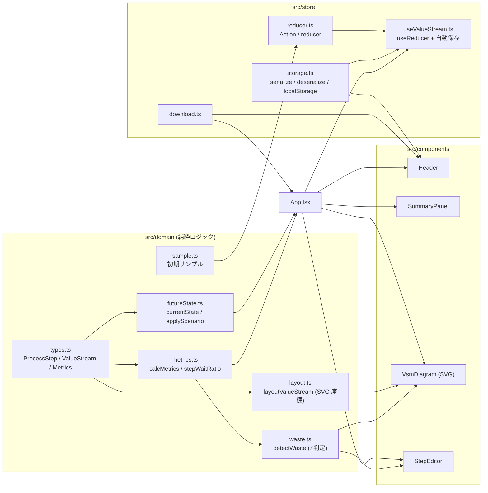
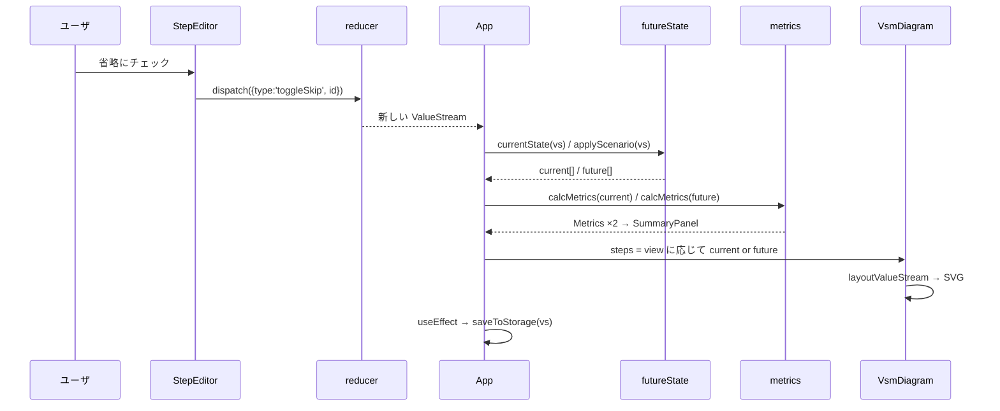
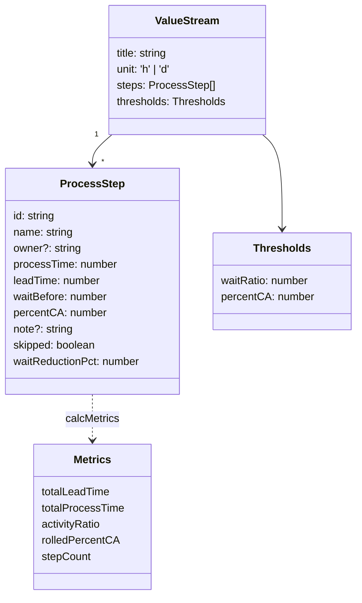
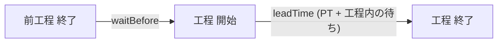
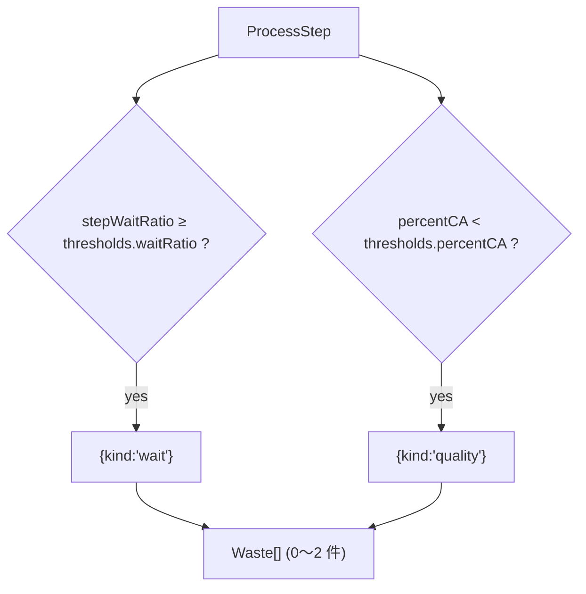
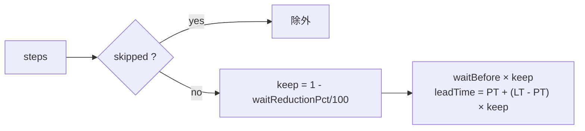
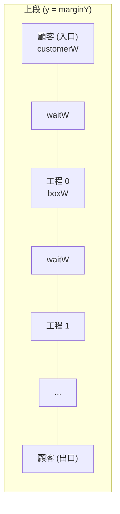
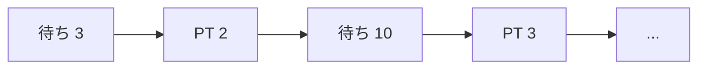

# コード解説: VSM Generator

## 全体像

純粋関数のドメイン層 (`src/domain`) と、React の UI 層 (`src/components`) を分け、
状態は `useReducer` で 1 か所 (`src/store`) にまとめている。
ドメイン層は DOM に依存しないので、Vitest で red/green のユニットテストが書きやすい。

## データの流れ

ユーザの操作は全て `dispatch(Action)` を通り、reducer が新しい `ValueStream` を返す。
`App` はそこから Current / Future の 2 系統の工程列を派生させ、それぞれ指標を計算する。

## データモデル

`skipped` と `waitReductionPct` は Future State 専用の設定で、Current State の計算では無視する (`currentState` が 0 / false に戻す)。

## 指標の計算 (metrics.ts)

1 工程が占める経過時間は「前工程からの待ち + 工程内 LT」。

| 指標 | 式 | 境界 |
|---|---|---|
| totalLeadTime | Σ (waitBefore + leadTime) | |
| totalProcessTime | Σ processTime | |
| activityRatio | totalProcessTime / totalLeadTime | 分母 0 のとき 0 |
| rolledPercentCA | Π (percentCA / 100) × 100 | 工程なしのとき 100 |
| stepWaitRatio (工程単位) | 1 - PT / LT | LT 0 のとき 0 |

## ⚡ 判定 (waste.ts)

「以上」と「未満」の境界はテストで固定している (`waste.test.ts`)。

## Future State (futureState.ts)

PT は変えず、待ち (工程前の待ちと工程内の待ち) だけを短縮する。
LT < PT という不正入力でも `Math.max(0, LT - PT)` で LT が PT を下回らないようにしている。

## SVG レイアウト (layout.ts)

工程は横一列なので、ライブラリを使わず座標を計算している。

- `x(i) = marginX + customerW + waitW + i × stepPitch` (stepPitch = boxW + waitW)
- 幅は `n × stepPitch` に比例して伸びる (テストで `l5.width - l1.width === 4 × stepPitch` を保証)
- 下段のタイムラインは、全経過時間を `n × stepPitch` の幅にスケールし、
  工程ごとに「待ち区間 (上段)」→「PT 区間 (下段)」を連続して並べる

## 永続化 (storage.ts)

`deserialize` は JSON を検証しつつ、欠けている項目を `createStep` のデフォルトで補う。
これにより古い保存データやユーザが手書きした JSON でも読める。
形が違う (steps が配列でない、unit が h/d 以外など) 場合は `null` を返し、UI 側でエラー表示する。

## テスト方針

| ファイル | 内容 |
|---|---|
| `domain/metrics.test.ts` | 0 件 / 1 件 / 複数件 / %C&A=0 / LT 合計 0 / skipped 除外 |
| `domain/waste.test.ts` | しきい値ちょうど・未満・両方該当 |
| `domain/futureState.test.ts` | 省略除外、待ち短縮の計算、不正入力、丸め |
| `domain/layout.test.ts` | 0 件 / 1 件 / 5 件の単調増加、幅の比例、タイムラインの連続性 |
| `store/reducer.test.ts` | 各 Action、並べ替えの境界、イミュータブル性 |
| `store/storage.test.ts` | serialize 往復、不正 JSON、欠損補完、localStorage |
| `App.test.tsx` | 描画、追加、省略で Future が変わる、しきい値変更でバッジが変わる |

全て「テストを書いて失敗を確認 → 実装 → 成功」の順で進めた。
